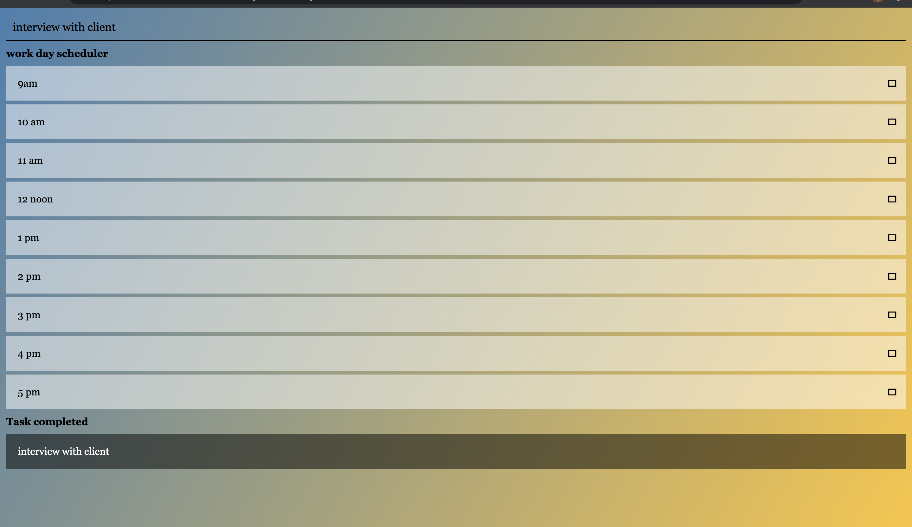

# Assignment5
# Title
Work day scheduler

# Content
This assignment is about building a day planner app using html, css, JavaScript and jQuery. This is the first app that I am building using jQuery. It also use the moment.js library to show the time.

# User story
The app is required for a user such that the days could be planned well in advance. The app have feature where they can plan the day ahead and make it run smoothly.

# Built with
The application is built using VS Code. The app is made using of html, css, javascript, jQuery and moment.js library.
 
# Screenshot of app
;

# deployed link of app

# Contact
Manish Neupane
email: mrnish.are@gmail.com
phone: 0416508908

# Acknowledgments
Instructor
Teaching assistant 
classmates
